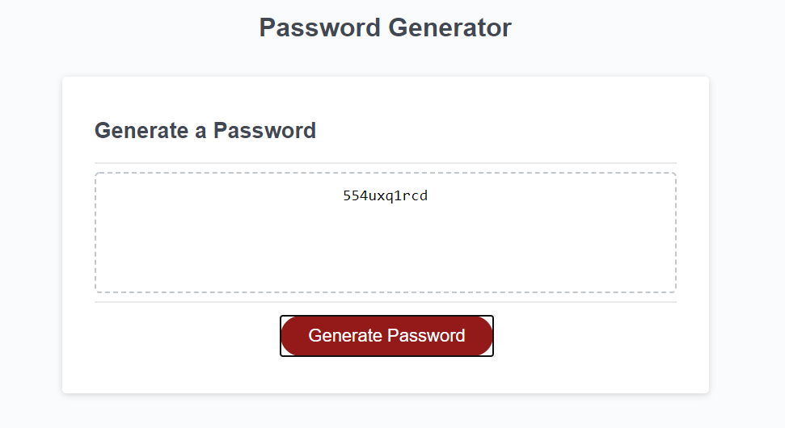
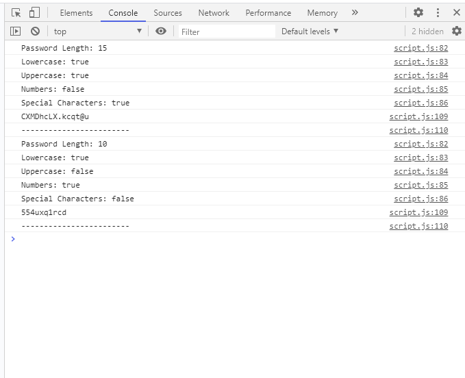

Password Generator that will ask for specified criteria to create a randomized generator, such as Capitalization, Numbers, and Special Characters.

User input and password parameters are logged in console.

Repository link: https://github.com/mgmoreno22/PasswordGenerator
Deployed Site link: https://mgmoreno22.github.io/PasswordGenerator/

Example image of Webpage output:

Example image of Console ouput:
